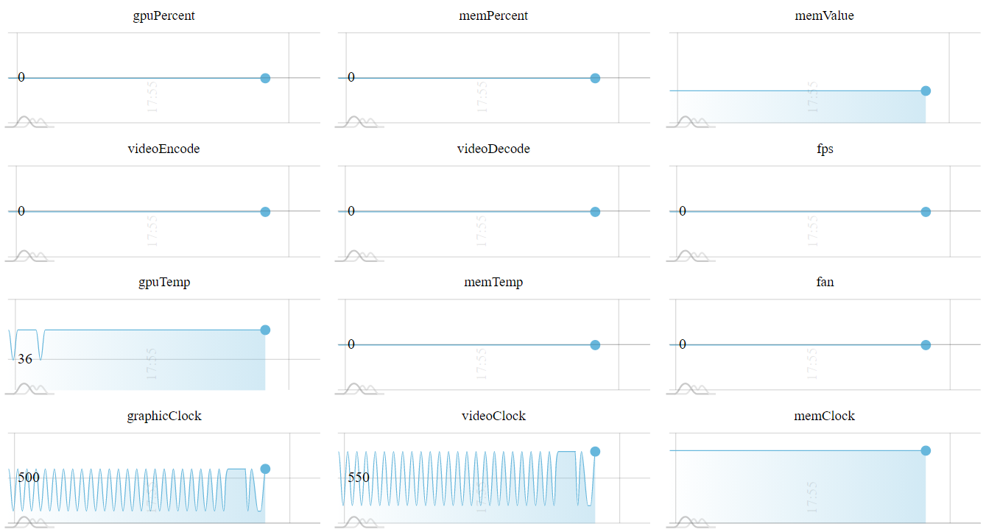

**Что это такое?**

Smi Rest - сервис для получения данных GPU в удобном формате и сборе статистики.

**Как установить?**

1. Для Windows и Linux нужно установить драйвер nvidia https://www.nvidia.com/Download/index.aspx
1. Для использования без контейнеризации установить Java 11 https://adoptopenjdk.net/
1. Для использования с контейнеризацией установить docker, docker-compose https://docs.docker.com/get-docker/
1. Для использования в Docker нужно установить NVIDIA Container Toolkit https://docs.nvidia.com/datacenter/cloud-native/container-toolkit/install-guide.html#docker

**Без Докера**

* Собрать проект `maven package`
* Или загрузить последний релиз https://github.com/lampaa/nvidia-smi-rest/releases/latest
* Запустить 'java -jar smirest-0.0.2.jar'

**С Докером**

1. Запустить `docker-compose -d up`

**REST API**

* http://localhost:8176/v1 - получить полный лог драйвера и устройств
* http://localhost:8176/v1/GPU-UUID - получить полный лог устройства
* http://localhost:8176/v1/GPU-a9685d8a-fbf2-7465-ee1f-307141ef06a8/pci/pciGpuLinkInfo/pcieGen - определенное поля лога устройства
* http://localhost:8176/stats - получить полную статистику
* http://localhost:8176/stats/GPU-UUID - получить статистику одного устройства
* http://localhost:8176/stats/graphs - получить графики статистики



**Maven зависимость**
```xml
<dependency>
    <groupId>com.github.lampaa</groupId>
    <artifactId>smirest</artifactId>
    <version>0.0.2</version>
</dependency>
```

**Использование**

```java
NvidiaSmiLogType smi = SmiReader.read(); // read from system
NvidiaSmiLogType smi = SmiReader.read(new File("smi_log.xml")); // read from xml file
NvidiaSmiLogType smi = SmiReader.read(new FileInputStream("smi_log.xml")); // read from input stream
NvidiaSmiLogType smi = SmiReader.read("<xml>...</xml>"); // from string
NvidiaSmiLogType smi = SmiReader.read(new StringReader("<xml>...</xml>")); // from reader
``` 

**Документация**

* Swagger http://lampaa.github.io/com.lampa.smirest/swagger/index.html
* JavaDoc http://lampaa.github.io/com.lampa.smirest/docs/index.html